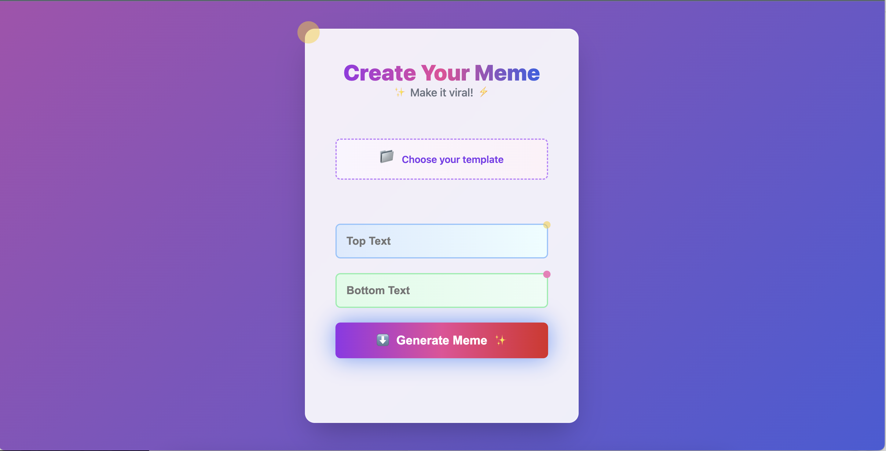
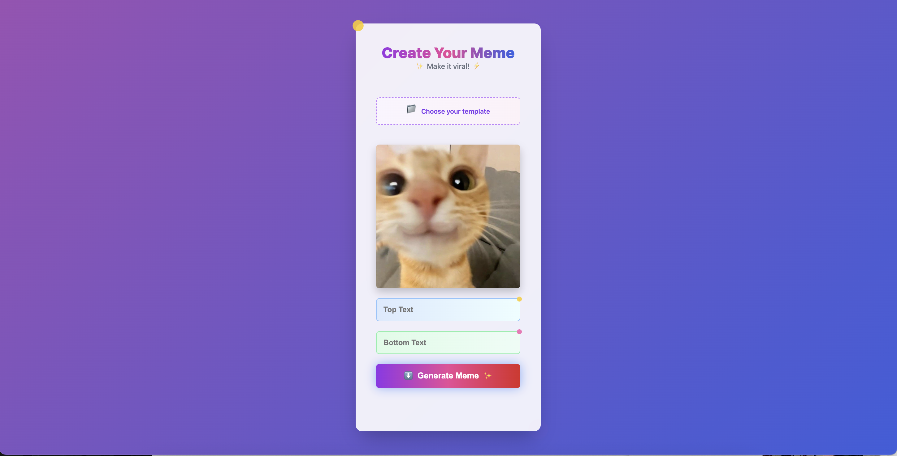
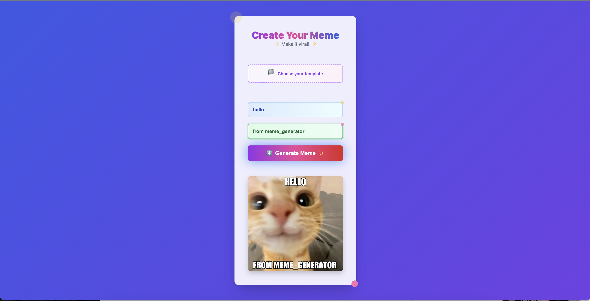

# Meme Generator



A vibrant, interactive web app for creating custom memes with top and bottom captions. Upload your own image, preview it live, and generate a meme—all in one seamless UI.

---

## 🚀 Features

* **Live Preview**: Instantly see your uploaded image before generating.
* **Custom Captions**: Add top and bottom text with automatic resizing to fit.
* **Transparent Loader**: Semi‑transparent overlay with a pulsing emoji while processing.
* **Animated UI**: Gradient background, floating emojis, frosted‑glass card, and smooth button animations.

---

## 🛠️ Getting Started

1. **Clone the repo**

   ```bash
   git clone https://github.com/<your-username>/meme-generator.git
   cd meme-generator
   ```
2. **Install dependencies**

   ```bash
   python3 -m venv venv
   source venv/bin/activate
   pip install -r requirements.txt
   ```
3. **Run locally**

   ```bash
   uvicorn main:app --reload
   ```
4. **Open** `http://127.0.0.1:8000` in your browser.

---

## 📦 Project Structure

```
├── main.py            # FastAPI backend
├── requirements.txt   # Python packages
├── static/            # Public assets
│   ├── css/style.css
│   ├── js/script.js
│   ├── fonts/Impact.ttf
│   
├── template/          # Jinja2 template for local testing
│   └── index.html
└── ss1.png     # Demo screenshot for README
└── ss2.png
└── ss3.png
```




---

## 🤝 Contributing

Contributions are welcome! Feel free to open issues or submit pull requests for enhancements, bug fixes, or new features.

---

## 📄 License

This project is licensed under the MIT License.
